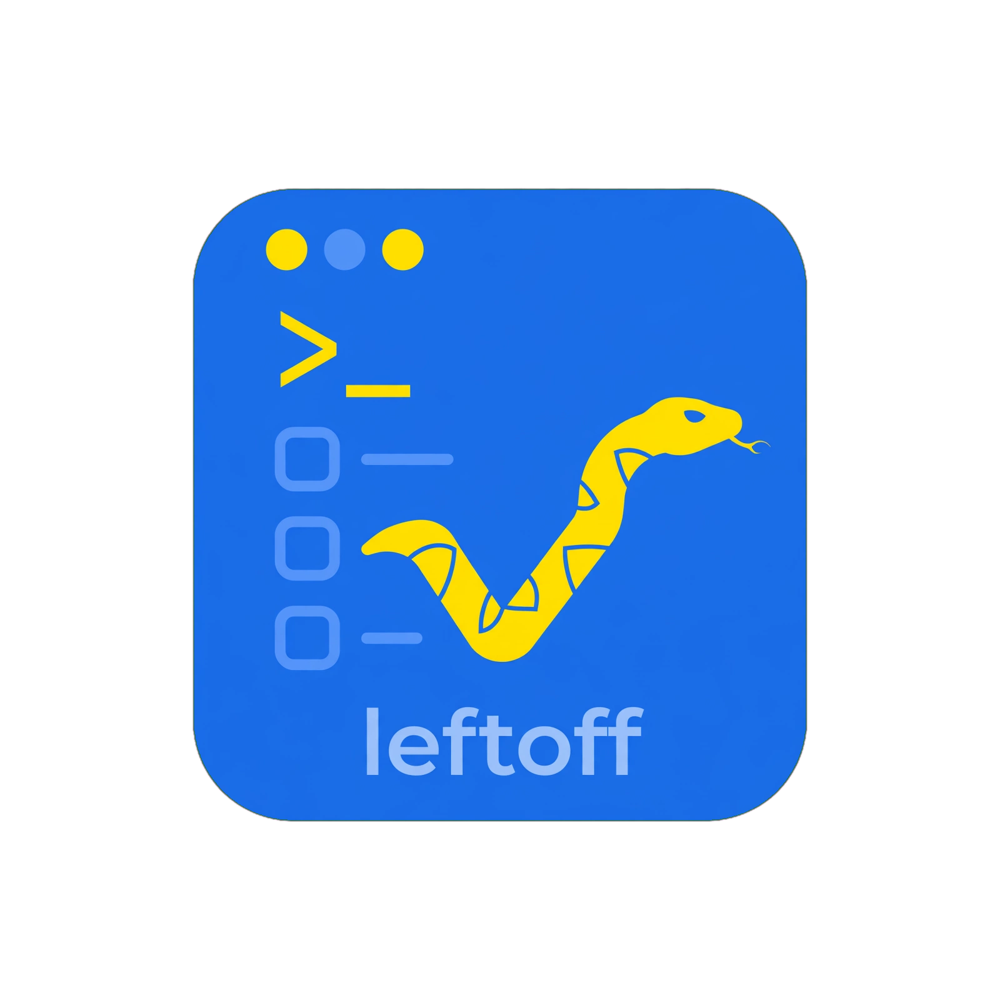
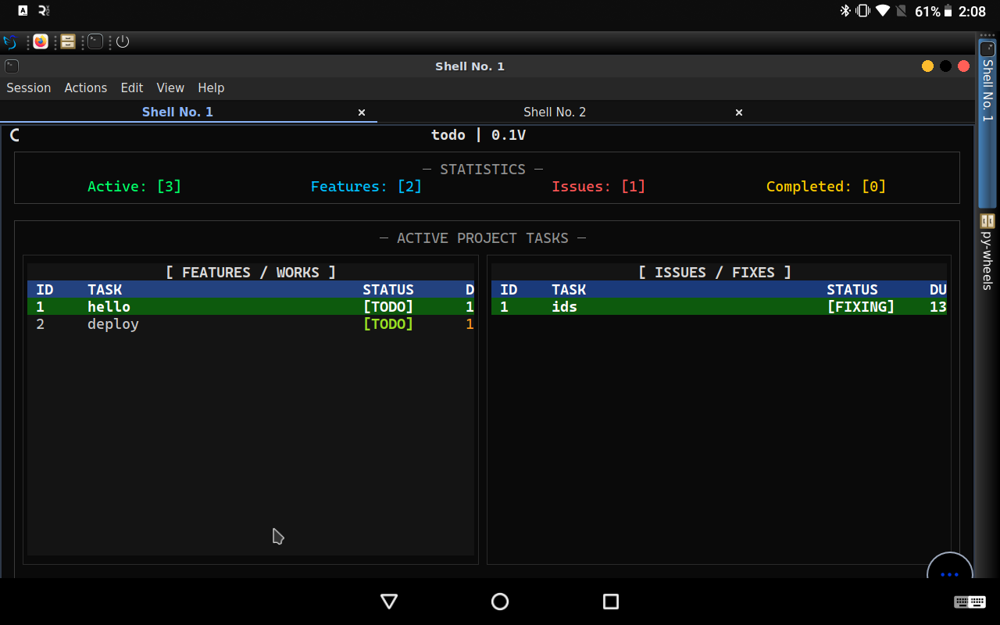

<div align="center">

#  leftoff

### Never lose track of where you left off.

A fast, keyboard-driven **CLI + TUI** for tracking project **features** and **issues** — right from your terminal.

<!-- PyPI -->
[](https://pypi.org/project/leftoff/)
[](https://pypi.org/project/leftoff/)
[](https://pypi.org/project/leftoff/)

<!-- GitHub Actions -->
[](https://github.com/shaheen-coder/leftoff/actions/workflows/publish.yml)

<!-- Project -->
[](LICENSE)
[](https://github.com/shaheen-coder/leftoff/stargazers)
[](https://github.com/shaheen-coder/leftoff/issues)
[](https://github.com/shaheen-coder/leftoff/commits)

<!-- Tooling -->
[](https://www.python.org/)
[](https://github.com/Textualize/textual)
[](https://github.com/Textualize/rich)
[](https://github.com/astral-sh/uv)
[](https://pyrefly.org/)
[](https://docs.pytest.org/)

</div>

---

## 📸 Screenshot

<p align="center">
  
</p>


---


## ✨ Features

- 🗂️ **Two lists, one tool** — track **Features** and **Issues** separately
- 🆔 Every task carries an **ID**, **task description**, **due date**, and **status**
- 🖥️ Full **TUI** (built with [Textual](https://github.com/Textualize/textual)) for browsing and managing tasks visually
- ⌨️ Lightweight **CLI** for quickly adding and updating tasks without leaving the terminal
- 🎨 Rich-formatted CLI output via [Rich](https://github.com/Textualize/rich)
- 🐍 Pure Python — no external services, no database server, no config headaches
- ⚡ Local-first, fast, and dependency-light

---

## 📦 Installation

**Using [uv](https://github.com/astral-sh/uv) (recommended):**

```bash
uv pip install leftoff
```

**Using pip:**

```bash
pip install leftoff
```

**From source:**

```bash
git clone https://github.com/shaheen-coder/leftoff.git
cd leftoff
uv sync
```

---

## 🚀 Usage

```bash
# Initialize leftoff in your project
leftoff --init

# Add a feature task — due in 3 days from today
leftoff --mode 'feat' --add "task name,number of days to finish"
leftoff --mode 'feat' --add "add other tasks,3"

# Add an issue task
leftoff --mode 'issue' --add "Fix crash on startup,1"

# Update a task's status (id,status)
leftoff --mod "3,FIXING"
leftoff --mod "3,DONE"

# Remove a task by id
leftoff --rm "3"

# Launch the interactive TUI
leftoff --tui
```

### CLI Reference

| Flag | Description |
|---|---|
| `--init` | Initialize a leftoff project (creates initial project details) |
| `--mode 'feat'\|'issue'` | Select which list to operate on: features or issues |
| `--add "task name,days"` | Add a new task; due date is `days` from today |
| `--mod "id,status"` | Update a task's status — `TODO`, `FIXING`, or `DONE` |
| `--rm "id"` | Remove a task by its id |
| `--tui` | Launch the interactive TUI |

> Run `leftoff --help` for the full, up-to-date option list.

---

## 🖥️ TUI

Launch the terminal UI to browse, filter, and manage tasks visually:

```bash
leftoff --tui
```

The TUI gives you a live, navigable view of both your **Features** and **Issues** lists, with keyboard shortcuts to add, edit, complete, and delete tasks without touching the CLI.

---

## 🛠️ Development

This project uses [`uv`](https://github.com/astral-sh/uv) for environment/dependency management, [`pyrefly`](https://pyrefly.org/) for type checking, and [`pytest`](https://docs.pytest.org/) for testing.

```bash
# Clone the repo
git clone https://github.com/shaheen-coder/leftoff.git
cd leftoff

# Install dependencies
uv sync

# Run type checks
uv run pyrefly check .

# Run the test suite
uv run pytest

# Run the CLI locally
uv run leftoff --help
```

---

## 🤝 Contributing

Contributions are welcome!

1. Fork the repository
2. Create your feature branch (`git checkout -b feature/amazing-thing`)
3. Make your changes and add tests
4. Ensure `uv run pyrefly check .` and `uv run pytest` pass
5. Commit your changes (`git commit -m "Add amazing thing"`)
6. Push to the branch (`git push origin feature/amazing-thing`)
7. Open a Pull Request

Please open an issue first for major changes to discuss what you'd like to change.

---

## 📄 License

This project is licensed under the **MIT License**. See [LICENSE](LICENSE) for details.

---

## 🙏 Built With

- [Textual](https://github.com/Textualize/textual) — TUI framework
- [Rich](https://github.com/Textualize/rich) — terminal formatting
- [uv](https://github.com/astral-sh/uv) — Python packaging & environments
- [pyrefly](https://pyrefly.org/) — static type checking
- [pytest](https://docs.pytest.org/) — testing framework

---

<div align="center">

Made with 🐍 by [shaheen-coder](https://github.com/shaheen-coder)

</div>
